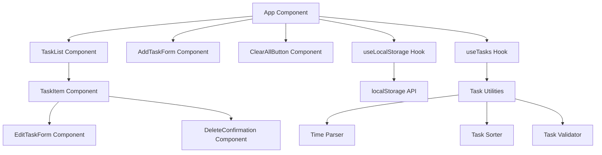

# Design Document

## Overview

The Day Planner is a single-page React application built with TypeScript and Vite that provides a clean, accessible interface for managing daily tasks. The application follows a component-based architecture with clear separation of concerns, utilizing React hooks for state management and custom hooks for localStorage persistence. The design emphasizes simplicity, accessibility, and responsive behavior across different screen sizes.

## Architecture

### High-Level Architecture



### Technology Stack

- **Frontend Framework**: React 18 with TypeScript
- **Build Tool**: Vite for fast development and optimized builds
- **Styling**: CSS Modules or styled-components for component-scoped styles
- **State Management**: React hooks (useState, useEffect, useReducer)
- **Persistence**: localStorage API with error handling
- **Testing**: Vitest for unit tests, React Testing Library for component tests
- **Accessibility**: ARIA attributes, semantic HTML, keyboard navigation

## Components and Interfaces

### Core Data Types

```typescript
interface Task {
  id: string;
  time: string; // Format: "HH:MM" (24-hour)
  title: string;
  priority?: 'low' | 'medium' | 'high';
  createdAt: number; // Timestamp for tiebreaking
}

interface TaskFormData {
  time: string;
  title: string;
  priority?: 'low' | 'medium' | 'high';
}

interface ValidationError {
  field: string;
  message: string;
}
```

### Component Hierarchy

#### App Component
- **Purpose**: Root component managing global state and layout
- **State**: 
  - `tasks: Task[]` - Current task list
  - `error: string | null` - Global error messages
- **Responsibilities**:
  - Initialize tasks from localStorage
  - Provide task CRUD operations
  - Handle global error states
  - Manage responsive layout

#### TaskList Component
- **Purpose**: Display sorted list of tasks
- **Props**: 
  - `tasks: Task[]`
  - `onEdit: (task: Task) => void`
  - `onDelete: (id: string) => void`
- **Features**:
  - Empty state display
  - Accessible list structure
  - Keyboard navigation support

#### TaskItem Component
- **Purpose**: Individual task display and interaction
- **Props**:
  - `task: Task`
  - `onEdit: () => void`
  - `onDelete: () => void`
- **State**:
  - `isEditing: boolean`
  - `showDeleteConfirm: boolean`
- **Features**:
  - Inline editing capability
  - Delete confirmation modal
  - Priority visual indicators
  - Time-based styling

#### AddTaskForm Component
- **Purpose**: Form for creating new tasks
- **State**:
  - `formData: TaskFormData`
  - `errors: ValidationError[]`
  - `isSubmitting: boolean`
- **Features**:
  - Real-time validation
  - Accessible form controls
  - Error message display
  - Auto-focus on mount

#### EditTaskForm Component
- **Purpose**: Inline editing form for existing tasks
- **Props**:
  - `task: Task`
  - `onSave: (task: Task) => void`
  - `onCancel: () => void`
- **Features**:
  - Pre-populated form fields
  - Validation with error display
  - Escape key to cancel
  - Enter key to save

### Custom Hooks

#### useLocalStorage Hook
```typescript
function useLocalStorage<T>(key: string, initialValue: T): [T, (value: T) => void, string | null]
```
- **Purpose**: Manage localStorage with error handling
- **Returns**: `[value, setValue, error]`
- **Features**:
  - Automatic JSON serialization
  - Error handling for corrupted data
  - Storage quota exceeded handling

#### useTasks Hook
```typescript
function useTasks(): {
  tasks: Task[];
  addTask: (taskData: TaskFormData) => void;
  updateTask: (id: string, taskData: TaskFormData) => void;
  deleteTask: (id: string) => void;
  clearAllTasks: () => void;
  error: string | null;
}
```
- **Purpose**: Centralized task management logic
- **Features**:
  - Automatic sorting after mutations
  - ID generation for new tasks
  - Error state management
  - localStorage persistence

## Data Models

### Task Management

Tasks are stored as an array in localStorage under the key `dayPlannerTasks`. The data structure ensures:

1. **Unique Identification**: Each task has a UUID-based ID
2. **Time Sorting**: Primary sort by time, secondary by createdAt timestamp
3. **Priority Handling**: Optional priority field with visual indicators
4. **Validation**: Strict validation for time format and required fields

### Time Format

- **Input Format**: Flexible parsing of "9:30", "09:30", "9:30 AM", "21:30"
- **Storage Format**: Normalized 24-hour format "HH:MM"
- **Display Format**: User-friendly 12-hour format with AM/PM

### Sorting Algorithm

```typescript
function sortTasks(tasks: Task[]): Task[] {
  return tasks.sort((a, b) => {
    // Primary sort: by time
    const timeComparison = a.time.localeCompare(b.time);
    if (timeComparison !== 0) return timeComparison;
    
    // Secondary sort: by priority (high > medium > low)
    const priorityOrder = { high: 3, medium: 2, low: 1 };
    const aPriority = priorityOrder[a.priority || 'low'];
    const bPriority = priorityOrder[b.priority || 'low'];
    if (aPriority !== bPriority) return bPriority - aPriority;
    
    // Tertiary sort: by creation time (preserve insertion order)
    return a.createdAt - b.createdAt;
  });
}
```

## Error Handling

### localStorage Errors

1. **Storage Quota Exceeded**: Display warning and suggest clearing old data
2. **Corrupted Data**: Clear localStorage and show reset notification
3. **Access Denied**: Fallback to in-memory storage with warning

### Validation Errors

1. **Time Format**: Real-time validation with helpful error messages
2. **Required Fields**: Clear indication of missing required data
3. **Duplicate Prevention**: Optional warning for tasks at same time

### User Experience

- **Non-blocking Errors**: Use toast notifications for non-critical errors
- **Graceful Degradation**: Application remains functional even with localStorage issues
- **Clear Messaging**: User-friendly error messages with suggested actions

## Testing Strategy

### Unit Tests (Vitest)

#### Utility Functions
- **Time Parser**: Test valid/invalid time formats, edge cases
- **Task Sorter**: Test sorting with various combinations of time/priority
- **Validator**: Test all validation rules and error messages
- **localStorage Helper**: Test save/load/error scenarios

#### Custom Hooks
- **useLocalStorage**: Test persistence, error handling, initial values
- **useTasks**: Test CRUD operations, sorting, error states

### Component Tests (React Testing Library)

#### Integration Tests
- **Task Creation Flow**: Add task → verify in list → check localStorage
- **Task Editing Flow**: Edit task → verify updates → check sorting
- **Task Deletion Flow**: Delete task → confirm dialog → verify removal
- **Error Scenarios**: localStorage failures, validation errors

#### Accessibility Tests
- **Keyboard Navigation**: Tab order, Enter/Escape key handling
- **Screen Reader**: ARIA labels, semantic HTML structure
- **Focus Management**: Focus trapping in modals, logical focus flow

### Test Coverage Goals

- **Utility Functions**: 100% line coverage
- **Custom Hooks**: 95% line coverage
- **Components**: 85% line coverage with focus on user interactions
- **Integration**: All major user flows covered

### Testing Tools

```json
{
  "vitest": "^1.0.0",
  "@testing-library/react": "^13.0.0",
  "@testing-library/jest-dom": "^6.0.0",
  "@testing-library/user-event": "^14.0.0"
}
```

## Responsive Design

### Breakpoints

- **Mobile**: < 768px - Single column, stacked forms
- **Tablet**: 768px - 1024px - Optimized spacing, larger touch targets
- **Desktop**: > 1024px - Full layout with sidebar potential

### Mobile Adaptations

1. **Form Layout**: Stack time and title inputs vertically
2. **Task List**: Increase touch target sizes, swipe gestures for actions
3. **Modals**: Full-screen on mobile, centered on desktop
4. **Typography**: Responsive font sizes using clamp()

### Accessibility Features

1. **Keyboard Navigation**: Full keyboard accessibility
2. **Screen Readers**: Comprehensive ARIA labels and descriptions
3. **Color Contrast**: WCAG AA compliance (4.5:1 ratio minimum)
4. **Focus Indicators**: Clear visual focus states
5. **Reduced Motion**: Respect prefers-reduced-motion setting